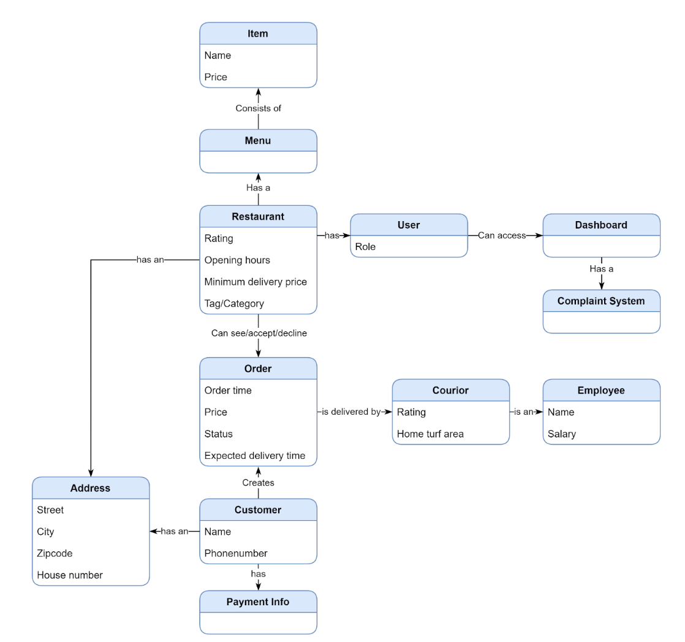
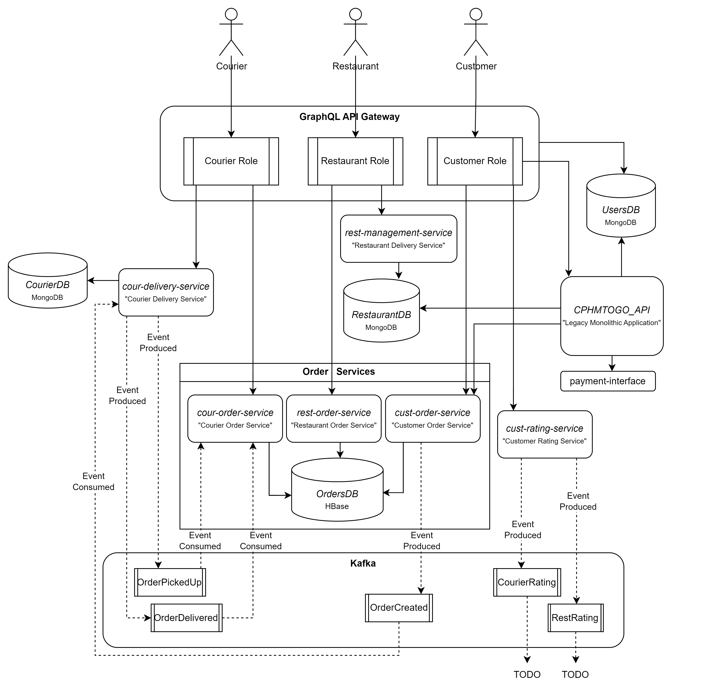

# Central Repository for software delevopment exam 2022
### Group members: 

**Name** Josef Marc Pedersen **Github** [@josefmarcc ](https://github.com/josefmarcc) **Email** cph-jp325@cphbusiness.dk  
**Name** Frederik Dinsen **Github**[@fdinsen](https://github.com/fdinsen) **Email** cph-fd77@cphbusiness.dk  
**Name** Sebastian Bentley **Github** [@sebastianbentley ](https://github.com/SebastianBentley) **Email** cph-sb287@cphbusiness.dk  
**Name** Frederik Dahl **Github** [@dahlfrederik ](https://github.com/dahlfrederik) **Email** cph-fd76@cphbusiness.dk  

## All repositories:
We have made a GitHub orginization for all repositories: [https://github.com/f2js](https://github.com/f2js)

The repositories for our services, can also be found here:
- [https://github.com/f2js/CPHMTOGO_API](https://github.com/f2js/CPHMTOGO_API)
- [https://github.com/f2js/cphmtogo_frontend](https://github.com/f2js/cphmtogo_frontend)
- [https://github.com/f2js/paymentsystem](https://github.com/f2js/paymentsystem)
- [https://github.com/f2js/cust-order-service](https://github.com/f2js/cust-order-service)
- [https://github.com/f2js/gateway](https://github.com/f2js/gateway)
- [https://github.com/f2js/cour-delivery-service](https://github.com/f2js/cour-delivery-service)
- [https://github.com/f2js/rest-management-service](https://github.com/f2js/rest-management-service)
- [https://github.com/f2js/rest-order-items-service](https://github.com/f2js/rest-order-items-service)
- [https://github.com/f2js/RatingProducer](https://github.com/f2js/RatingProducer)
- [https://github.com/f2js/cour-order-service](https://github.com/f2js/cour-order-service)
- [https://github.com/f2js/resource-provisioning](https://github.com/f2js/resource-provisioning)
- [https://github.com/f2js/KafkaSetup](https://github.com/f2js/KafkaSetup)

## Domain diagram 

## System diagram 

As we can see the entire system has been designed using **domain driven design** - which is why the structure of our system appears to be very close to the domain diagram exploring the business domain. 

**Domain-driven design (DDD)** is a software design approach that aims to create a common language between business stakeholders and technical team members by using a shared understanding of the business domain to inform the design of the software. It helps to improve communication and alignment between the business and technical aspects of an organization, and can lead to increased focus, flexibility, and quality in software development.
